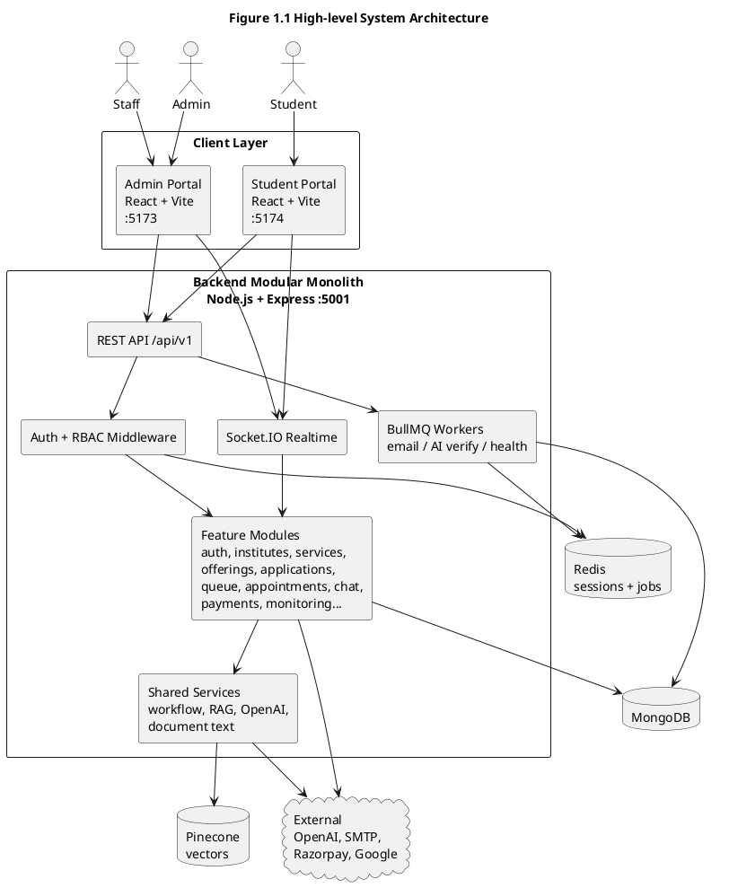
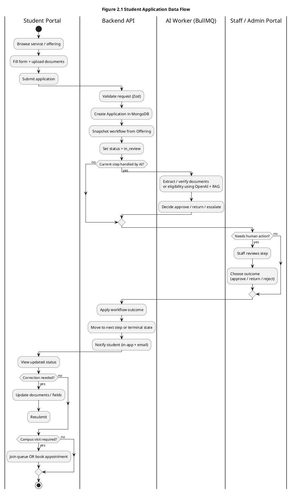
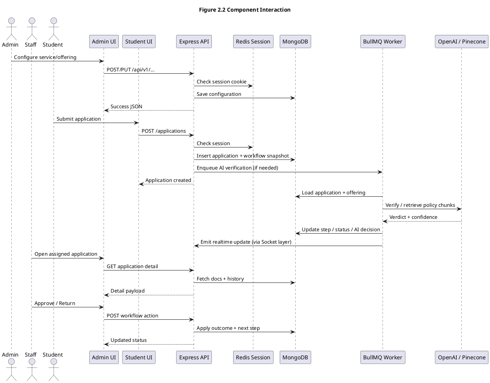
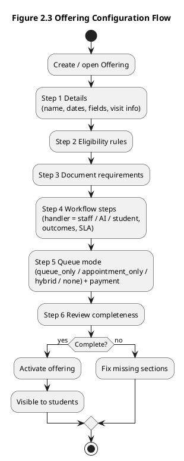
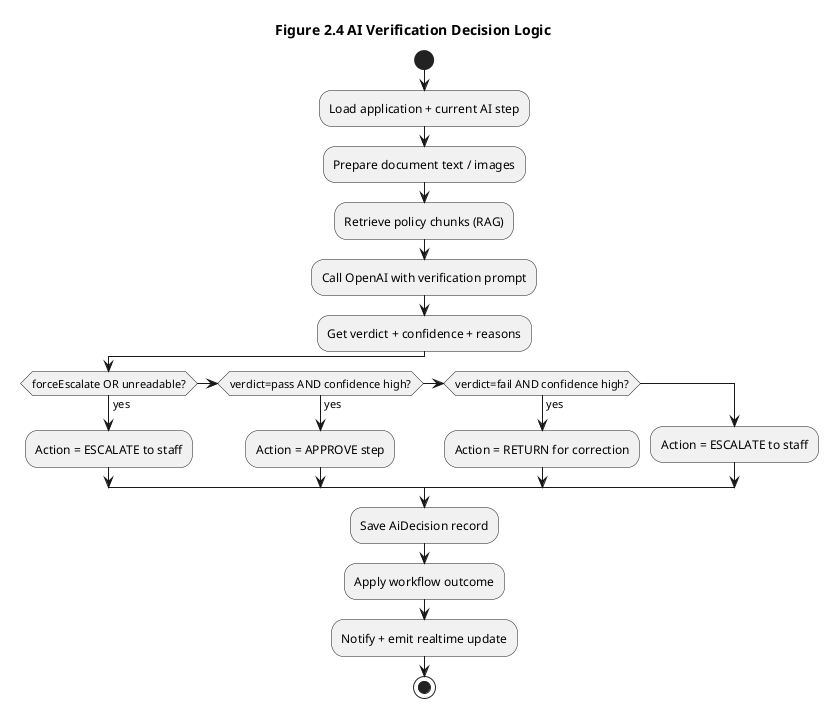
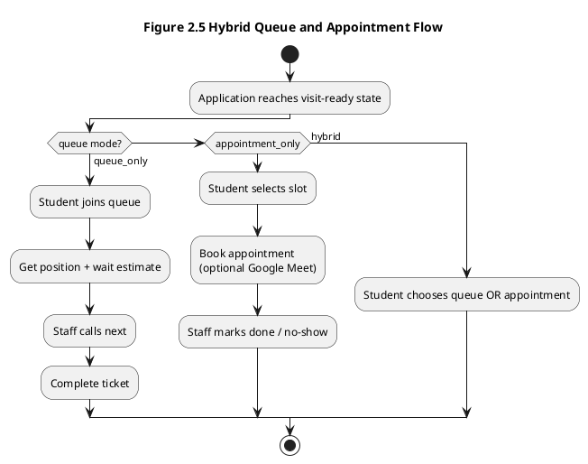
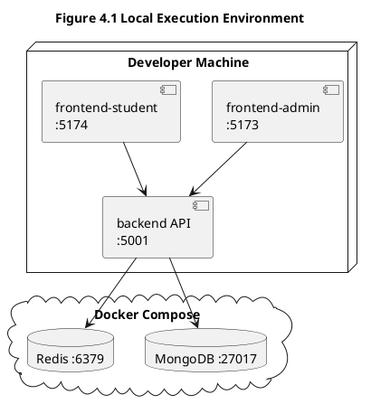

# Capstone Project Report — Complete Answers

> Easy-reading Markdown version. Original file kept as `Capstone_Report_Answers.txt`.

- **Source format:** Document-format (1).docx
- **Project:** Smart Workflow-Based Queue & Administrative Service Management System (BITS / Edu Admin Platform)
- **Repo:** https://github.com/bitsgroupadminai/admintool_BITS.git
- **Note:** Fill COVER PAGE fields (name, roll no., supervisor) yourself. PlantUML diagrams are given at the end of each related section so you can generate images later (plantuml.com / VS Code plugin).
- **Writing style:** Simple student wording, same chapter order as the format doc.

## Cover Page

**Project Title:**
Smart Workflow-Based Queue and Administrative Service Management System
for Educational Institutions

**Student Name(s) & Roll Number(s):**
[Write your full name and roll number here]

**Program:**
BSc Computer Science (Online Mode)

**Institution Name:**
BITS Pilani / [Your study centre name]

**Academic Year:**
2025–26

**Internal Supervisor Name:**
[Write supervisor name here]

## Declaration

I hereby declare that this capstone project titled “Smart Workflow-Based Queue
and Administrative Service Management System for Educational Institutions” is an
original work carried out by me and has not been submitted to any other
university or institution for the award of any degree.

I have used AI coding tools and online documentation only as helpers while
building and explaining the system. The design ideas, coding decisions, testing,
and final report content are based on my own project work.

Place: _______________
Date:  _______________
Signature: _______________

## Abstract (200–300 words)

**Problem context (brief):**
In many colleges and universities, student services like admissions, document
verification, fee related requests, certificates, and counselling are still
handled through PDFs, emails, spreadsheets, and long physical queues. Students
often do not know which documents are needed, whether they are eligible, or
where their request is stuck. Staff also struggle because each service has a
different process, and there is no clear workflow, queue visibility, or shared
knowledge base. Existing ERP tools mostly store records; they do not guide the
actual step-by-step work.

**Solution implemented:**
This project builds a workflow-first admin and student platform. Institute
admins can create services and programme offerings, upload policy documents,
and configure eligibility rules, document checklist, workflow steps, queue, and
appointments. AI helps suggest configuration from uploaded knowledge documents,
but the admin always reviews and activates. Students can enrol, apply, upload
documents, track request status, join a queue or book an appointment, and ask
a service chatbot. Staff review applications step by step. The system also
supports AI document/eligibility verification with confidence thresholds,
payments, notifications, analytics, ERP sync hooks, exports, and health
monitoring.

**Technologies used:**
Frontend: React, Vite, JavaScript, Tailwind CSS, Zustand, TanStack Query,
Axios, React Router, Socket.IO Client.
Backend: Node.js, Express.js, MongoDB (Mongoose), Redis, BullMQ, Socket.IO,
Zod, bcrypt, session cookies, Pino logging.
AI / RAG: OpenAI API, embeddings, Pinecone vector search, PDF/DOCX text
extraction.
Other: Docker (MongoDB + Redis), Razorpay, Nodemailer, Google Meet OAuth for
virtual appointments, Prometheus metrics.

**Outcomes and results:**
A working modular monolith was implemented with three parts: backend API,
admin/staff portal, and student portal. Core flows such as signup/setup,
service and offering configuration, application lifecycle, staff review,
queue/appointment, chat, AI verification, and monitoring were built and
tested locally. The platform shows that “guide before queue, workflow before
counter” can reduce confusion and make campus admin work more structured.

## Table of Contents

1. Cover Page, Declaration, Abstract
2. List of Figures
3. List of Tables
4. List of Abbreviations
5. Chapter 1: Introduction
6. Chapter 2: Implementation Details
7. Chapter 3: Testing, Validation & Results
8. Chapter 4: Execution / Deployment Details
9. Chapter 5: Project Execution Evidence
10. Chapter 6: Conclusion & Future Work
11. References
12. Appendix

## List of Figures

- Figure 1.1  High-level system architecture
- Figure 2.1  Data flow for student application lifecycle
- Figure 2.2  Component interaction (Admin → Backend → Student → Staff)
- Figure 2.3  Offering configuration wizard flow
- Figure 2.4  AI verification decision flow
- Figure 2.5  Queue and appointment hybrid flow
- Figure 4.1  Local deployment / demo environment

*(Generate these later from the PlantUML blocks in this file.)*

## List of Tables

- Table 2.1  Technology stack summary
- Table 2.2  Backend modules and purpose
- Table 2.3  User roles and main actions
- Table 3.1  Sample test cases and status
- Table 5.1  Weekly progress summary

## List of Abbreviations

| Abbreviation | Meaning |
| --- | --- |
| API | Application Programming Interface |
| AI | Artificial Intelligence |
| CRUD | Create, Read, Update, Delete |
| DTO | Data Transfer Object |
| ERP | Enterprise Resource Planning |
| JWT | JSON Web Token (not used as primary auth here) |
| LLM | Large Language Model |
| ODM | Object Document Mapper |
| RAG | Retrieval Augmented Generation |
| RBAC | Role Based Access Control |
| REST | Representational State Transfer |
| SLA | Service Level Agreement |
| SMTP | Simple Mail Transfer Protocol |
| SOP | Standard Operating Procedure |
| UI | User Interface |
| UX | User Experience |
| WS | WebSocket |

# Chapter 1: Introduction

(Note: Problem identification and system design were completed in the Study
Project. This chapter reuses that base and updates it for what was actually
implemented in the Capstone.)

### 1.1 Overview of the project

This capstone project is a web-based platform for educational institutes to
manage student administrative services in a clear, step-by-step way.

The product is split into three main parts:

1) Backend API (Node.js + Express)
- One modular monolith server
- Handles auth, institutes, users, services, offerings, applications,
queue, appointments, chat, payments, AI, monitoring, exports, ERP sync

2) Admin & Staff Portal (React)
- Institute signup and setup wizard
- Create services and offerings
- Upload knowledge documents and use AI suggestions
- Configure eligibility, documents, workflow, queue/appointments
- Review applications, manage students/staff, queue board, analytics,
payments, system health

3) Student Portal (React, separate app/domain)
- Institute home and enrolment
- Browse services, apply, upload documents
- Track request history and status
- Join queue or book appointment
- Chat with service guidance assistant
- Profile and password flows

The main idea of the product is:
“Guide before queue, workflow before counter.”

That means students should first understand eligibility, documents, and
process. Only then should they enter a queue or appointment. Every request
moves through named workflow steps with clear handlers (staff, AI, or student)
and outcomes (approve, return for correction, reject, etc.).

### 1.2 Problem Statement & Motivation

**Problem:**
Educational offices still depend on manual and disconnected tools. Common
problems seen in real campus life are:

- Students visit campus many times because information is unclear.
- Staff follow different rules for the same service.
- Documents get checked late, so corrections take too long.
- There is little visibility of where a request is stuck.
- Queues become crowded without prior guidance.
- Knowledge is locked inside PDFs and senior staff minds.
- ERP systems store final data but do not run day-to-day operational workflows.

**Motivation:**
Colleges need one operational layer that sits above or beside ERP. It should:

- convert policy documents into workable service configuration
- enforce a workflow for every request
- support hybrid queue + appointment handling
- help students with chat answers from institute knowledge
- give admins and staff dashboards for workload and SLA issues
- keep humans in control (AI suggests or assists; admin/staff decide)

This project was motivated by that gap between “record systems” and real
operational work.

### 1.3 Objectives of the capstone

The main objectives completed in this capstone are:

1. Design and implement a modular monolith backend for institute admin services.
2. Build an admin/staff portal for setup, service/offering configuration, and
request review.
3. Build a student portal for enrolment, application, tracking, queue/
appointment, and guidance chat.
4. Implement stateful session authentication with Redis and role-based access
(admin, staff, student).
5. Implement workflow-first application processing with step handlers and
outcomes.
6. Add AI-assisted knowledge extraction and offering configuration support.
7. Add AI verification for documents/eligibility with confidence-based
approve / return / escalate decisions.
8. Support hybrid queue and appointment operations with real-time updates.
9. Add supporting features: notifications/email, payments (Razorpay), analytics,
exports, ERP sync hooks, and health monitoring.
10. Test key flows end-to-end and document deployment for local demo.

### 1.4 Scope of implementation

**In scope (implemented / largely implemented):**

- Multi-role auth: admin signup, staff created by admin, student accounts /
enrolment flows
- Institute setup wizard
- Services and knowledge document upload (PDF/DOCX)
- Offering configuration wizard (details, eligibility, documents, workflow,
queue/appointment, review, activate)
- Application submit, staff/admin review actions, correction/resubmit
- AI configuration suggestions and AI verification worker
- Student chat with RAG over service knowledge
- Queue join/call/complete and appointment booking
- Notifications and email hooks
- Payments module (Razorpay)
- Basic analytics dashboards
- Monitoring/readiness/metrics
- Export and ERP sync admin APIs
- Local Docker setup for MongoDB and Redis

**Out of scope / limited for this version:**

- Full microservices or Kubernetes
- Native mobile apps
- Full SSO / MFA
- Complete deep funnel analytics for every bottleneck metric
- Fully autonomous AI decisions without human review thresholds
- Replacing the institute ERP (this system integrates / syncs, does not replace)

### 1.5 Organization of the report

Chapter 1 explains the problem, goals, and scope.
Chapter 2 explains architecture, tech stack, modules, algorithms, and sample
implementation points.
Chapter 3 covers testing strategy, test cases, and results.
Chapter 4 covers how to run and deploy the system for demo.
Chapter 5 records project execution evidence (repo, weekly work, supervisor
reviews).
Chapter 6 concludes with achievements, limits, and future work.
References and Appendix give sources, user manual, install guide, and links.

# Chapter 2: Implementation Details

### 2.1 System Architecture & Design

### 2.1.1 High-level architecture

The system follows a Modular Monolith architecture (not microservices).
All business modules live in one Node.js backend, but each feature is kept in
its own folder (auth, offerings, applications, queue, chat, etc.).

**Main layers:**

#### A) Client layer

- frontend-admin (port 5173)
- frontend-student (port 5174)

#### B) API / Realtime layer

- Express REST API under /api/v1
- Socket.IO for live queue / application updates
- Session cookie auth checked against Redis

#### C) Application services layer

- Feature modules with controller → service → model pattern
- Shared helpers for workflow execution, RAG, documents, eligibility

#### D) Background workers

- BullMQ workers on Redis (email, AI verification, health monitor)

#### E) Data stores

- MongoDB for long-term business data
- Redis for sessions, queues, cache
- Pinecone for vector embeddings (RAG)
- Local uploads / optional cloud file storage patterns

#### F) External services

- OpenAI (LLM + embeddings)
- SMTP email
- Razorpay payments
- Google OAuth/Meet for virtual appointments
- ERP sync API endpoints

#### PlantUML — Figure 1.1 High-level architecture

(Copy into PlantUML to generate image)



### 2.1.2 Data flow diagram

Example: student submits an application and it moves through workflow.

1. Student opens offering and fills form / uploads documents.
2. Backend validates input (Zod) and creates Application in MongoDB.
3. Workflow snapshot is copied from the offering (so later config changes do
not break already submitted requests).
4. Status becomes in_review; current step is set.
5. If current step is AI-handled, BullMQ AI worker runs verification.
6. AI returns pass/fail/uncertain + confidence.
7. Decision logic auto-approves, returns for correction, or escalates to staff.
8. Staff can approve / return / reject based on allowed outcomes.
9. Student gets notification/email and can track status or resubmit.
10. If visit is required, student joins queue or books appointment.

#### PlantUML — Figure 2.1 Application data flow



### 2.1.3 Component interaction

Components talk mainly through REST JSON APIs. Cookies carry session IDs.
Realtime events use Socket.IO rooms for institute/application/queue updates.

#### PlantUML — Figure 2.2 Component interaction



### 2.2 Technology Stack

**Table 2.1 Technology stack summary**

| Area | Choice | Why used (simple reason) |
| --- | --- | --- |
| Language | JavaScript (ES modules) | Same language for frontend/backend |
| Frontend framework | React + Vite | Fast UI development |
| Styling | Tailwind CSS + UI components | Consistent admin/student look |
| State | Zustand | Light client state |
| Server state | TanStack Query | Caching and refetch of API data |
| HTTP client | Axios | Cookie-based API calls |
| Routing | React Router DOM | Multi-page SPA routes |
| Forms/validation UI | React Hook Form + Zod | Safer forms |
| Realtime client | Socket.IO Client | Live queue/status updates |
| Backend runtime | Node.js | Good for I/O heavy APIs |
| Backend framework | Express.js | Simple modular REST API |
| Database | MongoDB + Mongoose | Flexible documents for workflows |
| Cache/session/jobs | Redis + BullMQ | Sessions + background workers |
| Auth | Stateful Redis sessions + cookie | Safer logout/control than pure JWT |
| Password security | bcrypt | Hash passwords |
| Validation | Zod | Shared request schema checks |
| Logging | Pino | Fast structured logs |
| Security | Helmet, CORS, rate limit | Basic production hardening |
| AI | OpenAI API | Extraction, verification, chat |
| Vectors | Pinecone | RAG similarity search |
| Docs parsing | pdf-parse, mammoth | Read PDF/DOCX knowledge files |
| Payments | Razorpay | Fee collection for offerings |
| Email | Nodemailer | Status and account emails |
| Metrics | prom-client | /metrics for monitoring |
| Infra local | Docker Compose (Mongo+Redis) | Easy local setup |

**Programming languages:**
- JavaScript for backend and both frontends

**Frameworks / libraries:**
- Express, React, Mongoose, BullMQ, Socket.IO, Zod, Tailwind, TanStack Query,
Zustand, Axios, React Hook Form

**Tools and platforms:**
- VS Code / Cursor, npm, Docker Desktop, MongoDB, Redis, OpenAI, Pinecone,
Razorpay dashboard, GitHub, browser DevTools, Node test runner

### 2.3 System Modules

**Table 2.2 Backend modules and purpose**

| Module | Purpose |
| --- | --- |
| auth | Login, signup, logout, password reset, sessions |
| institutes | Institute profile and setup completion |
| users | Admin/staff user management and roles |
| student | Student profiles, import, password change |
| services | Create/manage administrative services |
| knowledge-documents | Upload and process policy/SOP PDFs and DOCX |
| offerings | Programme/service offerings + AI suggestions + config |
| applications | Request lifecycle and staff/admin review APIs |
| ai-verification | AI worker decisions and decision history |
| queue | Join queue, call next, complete, wait estimates |
| appointments | Slot booking and staff/admin appointment ops |
| chat | Student service chatbot + sessions/messages |
| enrollment-intakes | Enrolment campaigns / intake management |
| payments | Admin payment views and Razorpay integration |
| notifications | In-app notifications |
| analytics | Dashboard counts and charts data |
| exports | Data export endpoints |
| erp-sync | ERP push/pull style admin + API hooks |
| monitoring | Health, readiness, metrics, system health page support |

**Table 2.3 User roles and main actions**

| Role | Main actions |
| --- | --- |
| Admin | Setup institute, manage staff/students, configure services/offerings, monitor analytics/health, payments, exports, ERP |
| Staff | Review assigned applications, queue board, appointments, enrolment intake work (based on staff role) |
| Student | Enrol/apply, upload docs, track status, chat, queue/appointment |

**Functional flow (end-to-end happy path):**

1. Admin signs up → creates institute.
2. Setup wizard: institute details → add staff → review → complete.
3. Admin creates a Service (example: Admissions / Certificate / Counselling).
4. Admin uploads knowledge documents and generates AI understanding.
5. Admin creates an Offering and configures:
Details → Eligibility → Documents → Workflow → Queue/Appointment → Review
6. Admin activates offering.
7. Student finds offering, applies, uploads required documents, submits.
8. Workflow starts. AI and/or staff process each step.
9. Student gets updates. If needed, corrects and resubmits.
10. If visit needed, student joins queue or books appointment.
11. Staff completes counter/visit step.
12. Application reaches approved/completed terminal state.

#### PlantUML — Figure 2.3 Offering configuration wizard



### 2.4 Key Algorithms / Logic

This section explains the important logic in simple words and short
pseudocode (based on actual backend helpers/services).

#### A) Stateful session authentication

Idea: After login, server creates a random session ID, stores user data in
Redis, and sends session ID in an HTTP-only cookie.

**Pseudocode:**

```text
FUNCTION login(email, password):
  user = findUserByEmail(email)
  IF user is null OR passwordHash mismatch THEN
    RETURN error "Invalid email or password"
  END IF
  sessionId = randomUUID()
  Redis.SET("session:" + sessionId, userPayload, TTL = inactivityHours)
  SetCookie(sessionId, httpOnly=true)
  RETURN success + redirect target by role
END FUNCTION

FUNCTION requireAuth(request):
  sessionId = readCookie()
  payload = Redis.GET("session:" + sessionId)
  IF payload is null THEN reject 401
  ELSE touch TTL and attach user to request
END FUNCTION
```

#### B) Workflow snapshot + step execution

Idea: When a student submits, the offering workflow is copied into the
application. Later edits to the offering do not change old applications.

**Pseudocode:**

```text
FUNCTION submitApplication(offering, formData, documents):
  snapshot = sort(offering.workflowSteps by order)
  app = create Application with:
    status = in_review
    workflowSnapshot = snapshot
    currentStepId = first step id
    form + documents
  IF first step handledBy.type == AI THEN
    enqueue AiVerificationJob(app.id)
  END IF
  RETURN app
END FUNCTION

FUNCTION applyOutcome(app, outcomeType):
  step = current step from app.workflowSnapshot
  outcome = find outcomeType in step.outcomes
  IF outcome routes to next step THEN
    app.currentStepId = nextStepId
    maybe enqueue AI again
  ELSE IF outcome is terminal THEN
    app.status = approved / rejected / completed etc.
  END IF
  save history entry
END FUNCTION
```

#### C) Role check for who can act on a step

**Pseudocode:**

```text
FUNCTION canUserActOnWorkflowStep(user, step):
  IF user.role == admin THEN RETURN true
  IF user.role != staff THEN RETURN false
  IF step.handledBy.type == student THEN RETURN false
  IF step.handledBy.type == AI THEN
    RETURN only if escalated for human review
  END IF
  IF step.handledBy.type == staff THEN
    RETURN user.staffRole matches assignee OR staffRole is general
  END IF
END FUNCTION
```

#### D) AI verification decision algorithm

Idea: AI never silently guesses. It gives verdict + confidence. Code decides
using thresholds. Uncertain cases go to staff.

**Typical thresholds used in tests:**
- autoApprove around 0.85
- autoReject around 0.80

**Pseudocode:**

```text
FUNCTION decideDocumentAction(verdict, confidence, thresholds, forceEscalate):
  IF forceEscalate THEN RETURN escalate
  IF verdict == pass AND confidence >= thresholds.autoApprove THEN
    RETURN approve
  END IF
  IF verdict == fail AND confidence >= thresholds.autoReject THEN
    RETURN return_for_correction
  END IF
  RETURN escalate
END FUNCTION
```

**For eligibility:**
- AI extracts fields from documents/form
- Deterministic rule engine compares extracted values to offering rules
- Combined with confidence to approve / return / escalate

#### PlantUML — Figure 2.4 AI verification decision flow



#### E) RAG chatbot retrieval

Idea: Knowledge documents and offering config are chunked, embedded, and
stored in Pinecone. At chat time, relevant chunks are retrieved and passed to
the LLM with the student question.

**Pseudocode:**

```text
FUNCTION answerStudentQuestion(serviceId, question):
  queryVector = embed(question)
  chunks = Pinecone.query(serviceId, queryVector, topK)
  context = join(chunks.text)
  answer = OpenAI.chat(systemPrompt + context + question)
  save chat message
  RETURN answer
END FUNCTION
```

#### F) Queue wait estimate (hybrid queue/appointment)

Idea: Student can join a live queue. Position and average handling time give
a simple wait estimate. Staff can call next and complete tickets. Appointment
mode uses slots instead of live queue. Hybrid allows both.

#### PlantUML — Figure 2.5 Queue / appointment hybrid flow



### 2.5 Screenshots / Code Snippets

(In the final PDF, paste real screenshots from your running demo.)

**Suggested screenshots to capture:**

1. Admin signup / login page
2. Institute setup wizard (institute → staff → review)
3. Services list and service detail with knowledge upload
4. Offering configure wizard (all steps)
5. Student enrol / apply page with document upload
6. Application detail on staff side with workflow actions
7. AI decisions panel on application review
8. Student request history / status page
9. Queue board (admin/staff) and student queue status
10. Appointment booking screen
11. Student service chat / guidance
12. Admin dashboard analytics
13. System health page
14. Payment related screen (if used in demo)

**Important code sections (explained simply; paste shortened snippets in PDF):**

Snippet idea 1 — session create (backend/src/core/services/session.service.js):
- Creates UUID session
- Stores JSON user payload in Redis with expiry

Snippet idea 2 — workflow snapshot
(backend/src/shared/helpers/workflowExecution.helper.js):
- Copies offering steps into application
- Finds current step and allowed actions

Snippet idea 3 — AI decision thresholds
(backend/src/modules/ai-verification/ai-verification.decision.js):
- Maps pass/fail/uncertain + confidence to approve/return/escalate

Snippet idea 4 — app route mounting (backend/src/app.js):
- Shows modular routers under /api/v1

(Do not paste secrets like API keys from .env into the report.)

# Chapter 3: Testing, Validation & Results

### 3.1 Test Plan

**Testing strategy:**
We used a mix of:

1) Manual end-to-end testing across three portals
(Admin → Staff → Student), following APP_TEST_GUIDE.txt style flows.

2) Unit tests for pure decision logic
Example: backend/tests/ai-verification.decision.test.js using Node’s
built-in test runner.

3) API / feature smoke checks while developing
Login, create service, configure offering, submit application, review,
queue join, chat ask, health endpoint.

4) Role-based access checks
Staff cannot access admin-only setup; students cannot call staff review
APIs; unauthenticated users get 401.

**Tools used:**
- Browser (Chrome/Edge) + DevTools
- Postman / Thunder Client style API calls (optional)
- npm run test (backend unit tests)
- Docker logs for MongoDB/Redis
- Backend Pino logs
- Socket.IO live UI behaviour observation
- Sample knowledge base text files under knowledge-bases/

**Test environments:**
- Local Windows machine
- Node.js 20+
- Docker Compose: MongoDB 7 + Redis 7
- Backend :5001, Admin :5173, Student :5174

### 3.2 Test Cases

**Table 3.1 Sample test cases**

| Test Case ID | Description | Input | Expected Output | Status |
| --- | --- | --- | --- | --- |
| TC-01 | Admin signup creates institute | Institute + admin credentials | Account created, setup wizard opens | Pass |
| TC-02 | Login with wrong password | Valid email + wrong password | Error: Invalid email or password | Pass |
| TC-03 | Complete institute setup | Institute details + staff | Setup marked complete, dashboard | Pass |
| TC-04 | Create service | Service name/description | Service appears in list | Pass |
| TC-05 | Upload knowledge PDF/DOCX | Valid document file | Document stored and processable | Pass |
| TC-06 | Generate AI understanding | Service with docs + API key | Suggestions for offerings/rules | Pass* |
| TC-07 | Configure offering all wizard steps | Valid config values | Completeness increases, can activate | Pass |
| TC-08 | Activate incomplete offering | Missing workflow/docs | Activation blocked / incomplete | Pass |
| TC-09 | Student apply with required docs | Form + uploads | Application created, in_review | Pass |
| TC-10 | Staff approve workflow step | Staff login + approve action | Moves to next step / approved | Pass |
| TC-11 | Return for correction | Staff return + notes | Student can edit and resubmit | Pass |
| TC-12 | AI clear pass auto-approve | High-confidence pass verdict | Action = approve | Pass |
| TC-13 | AI low confidence escalates | Pass with low confidence | Action = escalate | Pass |
| TC-14 | Student joins queue | Eligible application | Ticket + position + wait estimate | Pass |
| TC-15 | Staff call next / complete ticket | Waiting ticket | Ticket served/completed | Pass |
| TC-16 | Book appointment slot | Available slot | Appointment confirmed | Pass |
| TC-17 | Student chatbot answers from RAG | Service question | Relevant answer from knowledge | Pass* |
| TC-18 | Unauthorized staff API access | Student token/session | 401/403 rejected | Pass |
| TC-19 | Health endpoint | GET /api/v1/health | { status healthy } | Pass |
| TC-20 | Password reset request | Registered email | Reset flow accepted / email queued | Pass* |

* Pass* means dependent on external keys (OpenAI/SMTP) being configured.
Without keys, graceful fallback / skip behaviour was observed.

**How to read status:**
- Pass = verified in local demo / unit test
- Pass* = works when external service is configured

### 3.3 Results & Analysis

**Observations:**
1. Modular monolith structure made feature addition easier (new modules like
ai-verification, monitoring, erp-sync could be added without splitting
services).
2. Workflow snapshot design is important. It protects old applications when
admins change offerings later.
3. AI is useful as a helper, but threshold + escalate design is necessary for
trust. Low-confidence cases correctly go to humans.
4. Separating admin and student frontends keeps UX clean for each audience.
5. Redis is central: sessions, BullMQ jobs, and realtime support all depend on
it. If Redis is down, auth/jobs are affected (shown by readiness checks).
6. Manual configuration always remains available even if AI is disabled.

**Performance / accuracy notes (local demo level):**
- API health checks respond quickly on local machine.
- Unit tests for AI decision logic are deterministic and fast because they do
not call OpenAI.
- End-to-end AI verification quality depends on document clarity and prompt/
threshold settings. Clear scanned text performs better than blurry images.
- Queue wait estimate is an approximation based on position and configured
handling time, not exact real-world prediction.
- Chat answers are only as good as uploaded knowledge coverage. Missing docs
create weak answers (expected RAG behaviour).

**Overall result:**
The system meets the capstone goal of a working workflow-first educational
admin platform with AI assistance, hybrid queue/appointment support, and
clear role separation.

# Chapter 4: Execution / Deployment Details

### 4.1 Execution environment

**Hardware (example local demo):**
- Windows 10/11 PC
- Adequate RAM for Node + Docker (8 GB+ recommended)

**Software:**
- Node.js 20+
- npm
- Docker Desktop
- Modern browser
- Git / GitHub access

**Runtime services:**
- MongoDB 7 container (port 27017)
- Redis 7 container (port 6379)
- Backend API on http://localhost:5001
- Admin portal on http://localhost:5173
- Student portal on http://localhost:5174

### 4.2 Deployment steps (local)

**Step 1:** Start databases

```bash
docker compose up -d
```

**Step 2:** Backend

```bash
cd backend
copy .env.example to .env and fill values:
MONGODB_URI, REDIS_URL, SESSION_SECRET
ADMIN_CLIENT_URL, STUDENT_CLIENT_URL
OPENAI_API_KEY (optional but needed for AI features)
SMTP_* (optional for real email)
RAZORPAY_* (optional for payments)
Pinecone related env if using RAG vectors
npm install
npm run dev
```

**Step 3:** Admin portal

```bash
cd frontend-admin
npm install
npm run dev
```

**Step 4:** Student portal

```bash
cd frontend-student
npm install
npm run dev
```

**Step 5:** Demo login path

```bash
Open admin signup → create institute → complete setup → create service/
offering → activate → open student portal → apply → review as staff.
```

**Cloud deployment (possible future / optional note):**
Same apps can be hosted on any Node host (Render/Railway/VPS) with managed
MongoDB/Redis, environment variables, and two static/Node frontends. For this
capstone, local Docker + npm demo is the official execution path.

#### PlantUML — Figure 4.1 Local deployment diagram



### 4.3 Demo screenshots

Insert the same screenshots listed in Section 2.5 here, in demo order:

1. Landing / login
2. Setup complete
3. Service + offering active
4. Student submission
5. Staff/AI processing
6. Queue or appointment
7. Final approved status

### 4.4 Demo video link

[Paste your Google Drive / YouTube unlisted demo link here]

**Suggested demo script (3–7 minutes):**
1. Admin signup and setup
2. Upload knowledge doc and create offering with AI help
3. Activate offering
4. Student applies and chats for guidance
5. Staff/AI reviews application
6. Student joins queue or books appointment
7. Show dashboard / health page

# Chapter 5: Project Execution Evidence

### 5.1 Version Control Evidence

**GitHub repository link:**
https://github.com/bitsgroupadminai/admintool_BITS.git

**Commit history evidence:**
(Take a screenshot of GitHub commits / Insights → Contributors and paste in PDF.)

**What the commit history generally shows:**
- Backend module growth (auth → services → offerings → applications → queue →
chat → AI verification → monitoring/exports/ERP)
- Frontend admin pages and staff/student portal routes
- Workers, prompts, schemas, and tests added over time

**Branch used for development:**
[Write your working branch name, e.g. main / develop]

### 5.2 Weekly Progress Summary

(Fill supervisor remarks after reviews. Tasks below match real project phases.)

**Table 5.1 Weekly progress summary**

| Week | Task Planned | Task Completed | Supervisor Remark |
| --- | --- | --- | --- |
| 1 | Revisit study-project problem & architecture | Confirmed modular monolith + role split |  |
| 2 | Auth, institute setup, base API scaffolding | Signup/login/session/setup wizard working |  |
| 3 | Services + knowledge document upload | Service CRUD + PDF/DOCX upload pipeline |  |
| 4 | Offering configuration wizard | Eligibility/docs/workflow/queue config screens |  |
| 5 | Application lifecycle + staff review | Submit, assign/review, correction flow |  |
| 6 | Queue + appointment modules | Join queue, board actions, slot booking |  |
| 7 | Student portal core pages | Enrol/apply/services/history/guidance |  |
| 8 | AI extraction + RAG chat | Knowledge suggestions + chatbot retrieval |  |
| 9 | AI verification worker + decision thresholds | Approve/return/escalate logic + unit tests |  |
| 10 | Notifications, payments, analytics polish | Email/notification hooks, Razorpay, dashboards |  |
| 11 | Monitoring, exports, ERP sync hooks | Health/metrics/export/ERP admin APIs |  |
| 12 | Full integration testing + report writing | E2E demo script, test cases, final report answers |  |

(Adjust week numbers to your actual calendar if needed.)

### 5.3 Supervisor Interaction Summary

**Review dates:**
[Date 1] — Topic discussion / architecture review
[Date 2] — Mid implementation demo (admin + student basic flow)
[Date 3] — AI/queue features review
[Date 4] — Final demo and report check

**Key feedback received (write in your own words after meetings):**
**Example points you can adapt if they match your reviews:**
- Keep AI as assistant, not fully autonomous decision maker
- Make workflow steps visible and auditable
- Separate admin and student experiences clearly
- Show real demo with one complete service end-to-end
- Document installation steps clearly for evaluation

**Actions taken on feedback:**
- Added confidence thresholds and escalation path for AI verification
- Used workflow snapshot and application history
- Maintained two frontend apps
- Prepared local run steps and test guide
- Wrote this report in the required document sequence

# Chapter 6: Conclusion & Future Work

### 6.1 Summary of implementation

This capstone implemented a practical workflow-first platform for educational
administration. Institutes can configure services from knowledge documents,
students can apply with guidance, and staff/AI can process requests through
clear steps. Queue and appointment support help manage campus visits. The
system is built as a modular monolith with Redis sessions, MongoDB data,
BullMQ background jobs, and React portals for admin/staff and students.

### 6.2 Achievements

1. Working multi-portal product (admin/staff + student + API).
2. End-to-end service configuration and application workflow.
3. AI-assisted setup and AI verification with human escalation.
4. Hybrid queue and appointment handling with realtime support.
5. Supporting operations features: notifications, payments, analytics,
monitoring, exports, ERP sync hooks.
6. Test evidence through manual E2E flows and unit tests for decision logic.
7. Reproducible local deployment using Docker Compose.

### 6.3 Limitations

1. Some advanced analytics (deep bottleneck funnel, long-term SLA trends) are
still basic compared to full BI tools.
2. AI quality depends on document quality and API availability.
3. Not all edge operations (complex nested eligibility formulas, full holiday
calendar exceptions, complete audit UI) are fully productized.
4. Cloud production hardening (multi-instance sticky sessions, backups, CDN,
secret rotation policies) needs more work before large-scale production.
5. Mobile-native apps are not included.
6. ERP integration is available as hooks/APIs, not a full connector for every
vendor ERP.

### 6.4 Future enhancements

1. Richer analytics and bottleneck heatmaps per workflow step.
2. Stronger eligibility engine (OR groups, nested conditions, document-derived
checks).
3. Better knowledge versioning and “what changed in new PDF” admin review.
4. Mobile-responsive PWA or native apps for students.
5. Multi-institute SaaS billing and onboarding templates.
6. More automation around SLA breach alerts and auto-reassignment.
7. Broader ERP adapters and scheduled sync jobs.
8. Expanded automated API test suite and CI pipeline quality gates.
9. Offline-friendly counter mode for poor network campus desks.
10. Multilingual student guidance chatbot.

# References

(Use IEEE or APA consistently in final PDF. Examples below in simple IEEE style.)

[1] Fielding, R. T., “Architectural Styles and the Design of Network-based
Software Architectures,” Ph.D. dissertation, UC Irvine, 2000.
(REST architectural ideas)

[2] MongoDB Inc., “MongoDB Manual,” https://www.mongodb.com/docs/
(accessed 2026).

[3] Redis Ltd., “Redis Documentation,” https://redis.io/docs/
(accessed 2026).

[4] Express.js, “Express Documentation,” https://expressjs.com/
(accessed 2026).

[5] Meta Open Source, “React Documentation,” https://react.dev/
(accessed 2026).

[6] Vite Team, “Vite Documentation,” https://vitejs.dev/
(accessed 2026).

[7] BullMQ, “BullMQ Documentation,” https://docs.bullmq.io/
(accessed 2026).

[8] Socket.IO, “Socket.IO Documentation,” https://socket.io/docs/
(accessed 2026).

[9] OpenAI, “OpenAI API Documentation,” https://platform.openai.com/docs
(accessed 2026).

[10] Pinecone, “Pinecone Documentation,” https://docs.pinecone.io/
(accessed 2026).

[11] Razorpay, “Razorpay Docs,” https://razorpay.com/docs/
(accessed 2026).

[12] Zod, “Zod Documentation,” https://zod.dev/
(accessed 2026).

[13] Docker Inc., “Docker Documentation,” https://docs.docker.com/
(accessed 2026).

[14] Project internal documents:
- PRD Admin Tool NEW.md
- tech stack and project guidelines.md
- PROJECT_FEATURE_GAP_ANALYSIS.md
- APP_TEST_GUIDE.txt
- README.md

# Appendix

## Appendix A: User Manual (short)

### A.1 Admin

1. Open http://localhost:5173/signup and create institute admin.
2. Complete setup: institute profile → add staff → review.
3. Go to Services → create service.
4. Open service → upload knowledge documents → generate understanding.
5. Create offering → complete all configuration steps → Activate.
6. Manage students, applications, queue board, appointments, payments,
notifications, and system health from admin menu.

### A.2 Staff

1. Login with staff credentials created by admin.
2. Open assigned applications.
3. Review documents and take workflow actions (approve/return/reject).
4. Use queue board / appointments pages for visit handling.

### A.3 Student

1. Open http://localhost:5174 and select/open institute.
2. Enrol or login.
3. Browse services, check guidance/chat, apply to offering.
4. Upload required documents and submit.
5. Track status in request history.
6. Join queue or book appointment when asked.
7. Resubmit if returned for correction.

## Appendix B: Installation Guide

Prerequisites: Node.js 20+, Docker Desktop, Git.

1. Clone repo:
git clone https://github.com/bitsgroupadminai/admintool_BITS.git
2. Start DB:
docker compose up -d
3. Backend:
cd backend
cp .env.example .env   (Windows: copy .env.example .env)
Fill secrets and URLs
npm install
npm run dev
4. Admin UI:
cd frontend-admin
npm install
npm run dev
5. Student UI:
cd frontend-student
npm install
npm run dev
6. Verify:
Backend health: http://localhost:5001/api/v1/health
Admin: http://localhost:5173
Student: http://localhost:5174

## Appendix C: Source Code Link (GitHub)

https://github.com/bitsgroupadminai/admintool_BITS.git

## Appendix D: Demo Video Link

[Add your final demo video URL here]

## Appendix E: All PlantUML diagrams collected

(For convenience, regenerate figures from Chapter 2 and Chapter 4 blocks:
Figure 1.1, 2.1, 2.2, 2.3, 2.4, 2.5, 4.1)

## Formatting Reminder (for final PDF)

Font: Times New Roman
Size: 12 (Text), 14 (Headings)
Line Spacing: 1.5
Margin: 1 inch all sides
Page Numbers: Bottom-center
File Format: PDF

Tip: Copy content from this .txt into Word, apply the formatting above, insert
generated PlantUML images as figures, fill personal/supervisor blanks, then
export PDF.

---

*End of Capstone Report Answers*
